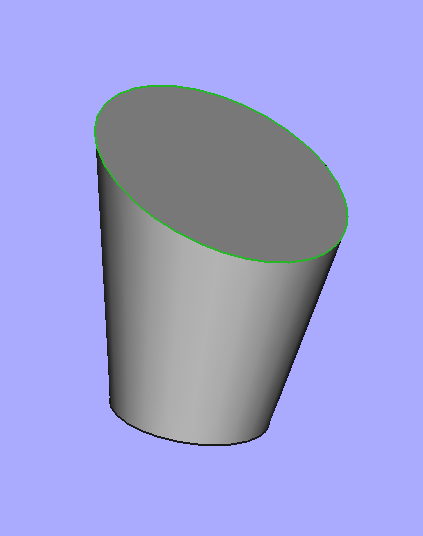
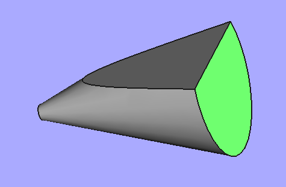
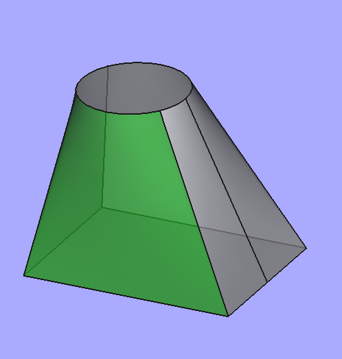
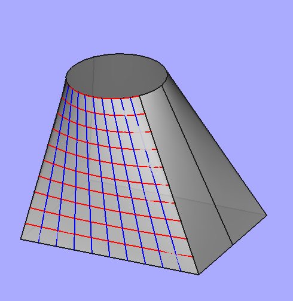

<link href="css/JMC_FreeCAD_Doc.css" rel="stylesheet">


<span id="table_of_content">Contents</span>

<!-- TOC -->

- [1. Topological and geometric sub-objects](#1-sous-objets-topologiques-et-g%C3%A9om%C3%A9triques)
    - [1.1. Introduction](#11-introduction)
        - [1.1.1. Généralités](#111-g%C3%A9n%C3%A9ralit%C3%A9s)
        - [1.1.2. Put into practice](#112-mise-en-pratique)
    - [1.2. Faces, Wires, Edges and Vertices](#12-faces-wires-edges-et-vertices)
    - [1.3. Geometric sub-objects](#13-sous-objets-g%C3%A9om%C3%A9triques)
        - [1.3.1. Support of a Vertex (Point)](#131-support-dun-vertex-point)
        - [1.3.2. Support of an Edge (Curve)](#132-support-dun-edge-curve)
        - [1.3.3. Support of a Face (Surface)](#133-support-dune-face-surface)
    - [1.4. Examples of use](#14-exemples-dutilisation)
        - [1.4.1. Coordinate curves of a surface](#141-courbes-coordonn%C3%A9es-dune-surface)
        - [1.4.2. Example with B-Splines](#142-exemple-avec-des-b-spline)
    - [1.5. And the reverse: from simple to complex?](#15-et-linverse%C2%A0-du-simple-au-complexe)
    - [1.6. Material to sort](#16-mat%C3%A9riel-%C3%A0-trier)

<!-- /TOC -->

# 1. Topological and geometric sub-objects

<i>This text reflects my experience of discovering these notions following in particular the reading on the forum of this <a href="https://forum.freecadweb.org/viewtopic.php?t=31313#p260053">post of Chris_B</a> or <a href="https://forum.freecadweb.org/viewtopic.php?f=22&amp;t=55956#p481439">this other</a> . We should not seek in what follows an exhaustive list of the properties concerned (which would be impossible) but rather an introduction allowing the reader to become a little more autonomous in the discovery of their manipulation.</i>

## 1.1. Introduction

### 1.1.1. General

A *FreeCAD* object naturally exposes some of its characteristics.

- A *Box* for example exposes its three dimensions in the *Property / Data* window, and the user can easily modify them there with immediate visualization of the result.
- It is the same for a (trunk of) cone, which exposes angle, height and its two radii.
- For a *PartDesign* object, it is in the functions ( *features* ) which were used to build it that we find certain properties such as for example dimension of a protusion; and we can also modify them with immediate effect on the *3D* representation.
- For an object of the *FeaturePython* type, the designer can also expose certain properties in the *Property / Data* window (cf. *addProperty* )

But there are many other entities that can be found in an object, and which are related to the format that *FreeCAD* uses to represent its *3D* objects internally: the [***B-Rep***](https://fr.wikipedia.org/wiki/B-Rep) ( ***B** oundary **Rep** resentation* in English) translated by *Border Representation* or *Border Representation* .

- In *FreeCAD* , with the exception of [*Mesh* type objects](https://wiki.freecadweb.org/Mesh) , almost all objects with a *3D* representation have a [Shape](https://wiki.freecadweb.org/Shape) .
- Unlike [CSG](https://fr.wikipedia.org/wiki/G%C3%A9om%C3%A9trie_de_construction_de_solides) which works from simple solids and Boolean operations, with *B-Rep* a *3D* object is fully represented by its edge. It is a technique that separates:
    - on the one hand, the topological elements, of type [*'Part :: TopoShape'*](https://wiki.freecadweb.org/Shape) , such as for example faces, edges, vertices) and the relations (adjacency, incidence) that they have between them;
    - on the other hand, geometric elements of the *Part :: Geom ... type* , such as *Part :: GeomLine* (for a line) or *'Part :: GeomCircle'* (for a circle); we can see the latter as the supports of the preceding ones, which define their position in space.
- A [*Body*](https://wiki.freecadweb.org/Body) created with [the *PartDesign*](https://wiki.freecadweb.org/PartDesign_Workbench) workshop has a *Shape* that can be found in *Bodyxxx.Shape* .
- [*A Part*](https://wiki.freecadweb.org/Part) type object which groups together several [*Bodies*](https://wiki.freecadweb.org/Body) therefore has a collection of *Shapes* , but none of its own.

On [this page](https://wiki.freecadweb.org/index.php?title=Topological_data_scripting) , we find a brief presentation and an interesting organization chart.

<a href="#table_of_content">Back Table of contents</a>

### 1.1.2. Put into practice

For a given object, all of these entities are in its *Shape* sub-object; for example, for a <span class="fr_obj">Box</span> created with the *Part* workshop, and which can be handled in *Python* using:

```python
>>> obj = App.ActiveDocument.Box
```

these topological and geometric entities are found in:

```python
>>> obj_shape = obj.Shape
```

The same is true for any *FreeCAD* *3D* object, regardless of how it has been constructed.

<a href="#table_of_content">Back Table of contents</a>

## 1.2. Faces, Wires, Edges and Vertices

In order of decreasing complexity, the main topological entities of a *3D* object referenced by <span class="py_var">obj</span> of *FreeCAD* are returned by the following properties.

- Evaluating <span class="py_atr">obj.Shape.Faces</span> returns the list of faces in <span class="py_var">obj</span> .

    - Thus for any integer <span class="py_var">i</span> strictly less than <span class="py_var">len (obj_shape.Faces)</span> ,

        ```python
        >>>> obj.Shape.Faces[i]
        ```

        gives a reference to the face of index <span class="py_var">i</span> of <span class="py_var">obj</span> .

    - Beware that *Python* programming, the index <span class="py_var">i</span> starts at *0,* while in the *Gui* *FreeCAD,* the indices of the faces that appear in the status bar start at *1.*

- <span class="py_atr">obj.Shape.Wires</span> returns the list of closed contours planes of <span class="py_var">obj</span> .

    - So for any integer <span class="py_var">j</span> strictly less than <span class="py_var">len (obj_shape.Wires)</span> ,
        ```python
        >>>> obj.Shape.Wires[j]
        ```
        returns a reference to the closed contour of index <span class="py_var">j</span> of <span class="py_var">obj</span> .
    - Same warning as above concerning the domain where
        <span class="py_var">j</span> varies.
    - However ***Wires*** is also a property of a face object and the instruction:
        ```python
        >>>> obj.Shape.Faces[i].Wires
        ```
        returns the list of all closed contours of the face of index <span class="py_var">i</span> of <span class="py_var">obj</span> .
    - On the other hand, the automatic completion does not work if you type:
        ```python
        >>>> obj.Shape.Faces[i].
        ```
        When the dot "." is thus preceded by a selector, the completion window does not seem to work correctly; to find it I had to make the assignment:
        ```python
        >>>> f = obj.Shape.Faces[i]
        ```
        before typing
        ```python
        >>>> f.
        ```
        and to be able to find it.

- <span class="py_atr">obj.Shape.Edges</span> returns the list of edges of <span class="py_var">obj</span> .

    - We can make exactly the same remarks as previously concerning the index
        <span class="py_var">k</span> allowing access to an element of such a list.
    - This
        <span class="py_atr">Edges</span> *property can be applied to a 3D* object as well as to one of its *Faces* , or even to one of its *Wires* ; it then returns the corresponding edges.

- <span class="py_atr">obj.Shape.Vertexes</span> lists the vertices of <span class="py_var">obj</span> ; but as before, this property can also be applied to one of its *Faces* , one of its *Wires* or one of its *Edges* .

As can be verified using the *Python* console, each of the preceding sub-objects has the same type, which is *Part :: TopoShape* .

```python
>>>> obj.Shape.Faces[0].TypeId , obj.Shape.Vertexes[0].TypeId

'Part::TopoShape' , 'Part::TopoShape'
```

However, each category has a different *ShapeType:*

```python
>>>> obj.Shape.Faces[0].ShapeType , obj.Shape.Vertexes[0].ShapeType

'Part::TopoShape' , 'Vertex'
```

Each of the preceding topological entities is associated with a geometric entity, the support on which it is built: a point, a curve or a surface. We study them below.

<a href="#table_of_content">Back Table of contents</a>

## 1.3. Geometric sub-objects

### 1.3.1. Support of a Vertex (Point)

- If <span class="fr_obj">Box</span> is a default cube built with *Part* , we get the list of its vertices with:
    ```python
    >>> App.ActiveDocument.Box.Shape.Vertexes
    [<Vertex object at 0x55a4e9d85bb0>, <Vertex object at 0x55a4e9dce3e0>, .... ]
    ```
- To obtain the vertex which is displayed as *Vertex6* in the status bar, type:
    ```python
    >>> v = App.ActiveDocument.Box.Shape.Vertexes[5] # Décalage de 1
    ```
- The recovery of the coordinates of the vertex is then done with:
    ```python
    >>> v.Point
    Vector (10.0, 0.0, 0.0)
    ```
- If we only want the list of points of *Face3* , we type:
    ```python
    >>> App.ActiveDocument.Box.Shape.Faces[2].Vertexes
    [<Vertex object at 0x55a4e98f1150>, <Vertex object at 0x55a4e8f62980>, ... ]
    ```

<a href="#table_of_content">Back Table of contents</a>

### 1.3.2. Support of an Edge (Curve)

If <span class="fr_obj">e</span> is an edge, so with <span class="py_atr">e.ShapeType == 'Edge'</span> , then:

```python
e.Curve
```

returns a reference to a curve containing it, and which *FreeCAD* most often treats as a parameterized curve.

Take the example of the (truncated) cone defined with the default values of the *Part* workshop.

- Let's start by getting the *Shape* of the object:
    ```python
    >>> obj_sh = App.ActiveDocument.Cone.Shape
    ```
- In my case, the top circle shows in the status bar as *Edge1* , so I get it back with:
    ```python
    >>> edg_1 = obj_sh.Edges[0]
    ```
    I can display the *ShapeType*
    ```python
    >>>> edg_1.ShapeType
    'Edge'
    ```
- I then point <span class="py_var">curv_1</span> to its <span class="py_atr">Curve</span>
    ```python
    >>> curv_1 = edg_1.Curve
    ```
- This curve is of type *'Part :: GeomCircle'* and, as can be seen, *FreeCAD* uses a parametric representation with an angle varying from 0 to 6.28 ... = 2π radians.
    ```python
    >>> curv_1.TypeId, curv_1.FirstParameter,curv_1.LastParameter
    'Part::GeomCircle' , 0.0 , 6.283185307179586
    ```
- I discovered the previous three properties using the usual completion in the *Python* console. It also allows you to find many other properties such as:
    ```python
    >>> curv_1.isPeriodic()
    True
    >>> curv_1.__doc__ # qui retourne la docstring
    'Describes a circle in 3D space ....'
    ```
- Note that we can also find the domain of variation of the parameter at the *Edge* level.
    ```python
    >>> edg_1.ParameterRange
    (0.0, 6.283185307179586)
    ```

Now let's take a look at the generator colored in green.

- In my case, I see it showing in the status bar like *Edge2* , so I get it back with:
    ```python
    >>> edg_2 = obj_sh.Edges[1]
    ```
- I can display the *ShapeType* :
    ```
    >>> edg_2.ShapeType
    'Edge'
    ```
- I then point *curv_2* to its *Curve* :
    ```python
    >>> curv_2 = edg_2.Curve
    ```
- This curve is of type *'Part :: GeomLine'*
    ```
    >>> curv_2.TypeId
    'Part::GeomLine'
    ```
- If, as before, we try to find the domain of the parameter, with *curv_2* :
    ```python
    >>> curv_2.FirstParameter , curv_2.LastParameter
    -2e+100 , 2e+100
    ```
    and with the topological object of which it is the support:
    ```python
    >>> edg_2.ParameterRange
    (0.0, 10.198039027185569)
    ```
    we see that *FreeCAD* treats here differently:
    - stops it ( *Edge* ) which is a segment therefore bounded,
    - its support which is an almost unbounded line ( *2e + 100* playing the role of infinity).

If one cuts the cone by a plane which is not orthogonal to its axis of symmetry, one obtains an ellipse or a hyperbola (even exceptionally a parabola) according to the orientation of the plane.

- If, as opposite, the ellipse is displayed as *Edge1* , the topological object is retrieved by:

    ```python
    edg = App.ActiveDocument.Cut.Shape.Edges[0]
    ```

    then its support by:

    ```python
    curv = edg.Curve

    ```

- With automatic completion, we see that we can have:

    ```python
    >>> curv.Eccentricity

    >>> curv.Focus1

    >>> curv.MajorRadius
    ```

    whose names are sufficiently eloquent.

The curious reader will be able to check:

- that in the case of an ellipse, the limits of the parameter are the same with
    <span class="py_var">edg</span> and with
    <span class="py_var">curv</span> ,
- whereas in the case of a hyperbola, the topological object remains bounded while its geometric support (as for the lines) is almost infinite!

<a href="#table_of_content">Back Table of contents</a>

### 1.3.3. Support of a Face (Surface)

If <span class="py_var">f</span> is a face, so <span class="py_var">f.ShapeType == 'Face'</span> , then <span class="py_var">f.Surface</span> returns a reference to a surface containing it, which *FreeCAD* treats as a parameterized surface, the parameters being called <span class="py_var">U</span> and <span class="py_var">V.</span>

Let us take the example of the (trunk of) cone defined with the default values of the *Part* workshop.

- Let's start by getting the *Shape* of the object:
    ```python
    >>> obj_sh = App.ActiveDocument.Cone.Shape
    ```
- In my case, the side surface (in green) shows in the status bar as *Face1* , so I get it back with:
    ```python
    >>> fac_1 = obj_sh.Faces[0]
    ```
    Recall that for the index there is an offset of *1* between what is seen in the *GUI* and that of the *Python* list.
- I can display the *ShapeType* :
    ```python
    >>> fac_1.ShapeType

    'Face'
    ```
- I then point <span class="py_var">surf_1</span> to its *Surface* which is of type *'Part :: GeomCone'*
    ```python
    >>> surf_1 = fac_1.Surface
    >>> surf_1.TypeId
    'Part::GeomCone'
    ```
- By using the completion, we see that we can then find its vertex, its axis (point &amp; vector), its half-angle at the vertex, ...
    ```python
    >>> surf_1.Apex
    Vector (0.0, 0.0, -10.0)
    >>> surf_1.Center , surf_1.Axis
    Vector (0.0, 0.0, 0.0) , Vector (0.0, 0.0, 1.0)
    >>> surf_1.Radius
    2.0
    >>> surf_1.SemiAngle
    0.19739555984988078
    ```
- This surface, of type *'Part :: GeomCone'* , is parameterized by the angle of rotation around the axis of the cone and the distance on the edge which is worth at most *10 / cos (surf_1.SemiAngle)* because the cone is height 10mm. We find this upper limit with the <span class="py_var">ParameterRange</span> of the face, but not with the surface whose generatrices are straight lines, therefore “infinite”.
    ```python
    >>> fac_1.ParameterRange
    (0.0, 6.283185307179586, 0.0, 10.198039027185569)

    >>> surf_1.bounds()   # ne pas oublier les ( ) car c'est une méthode
    (0.0, 6.283185307179586, -2e+100, 2e+100)
    ```

**Remark** The set of couples ( *U* , *V* ) making it possible to describe the entire surface is therefore the rectangle defined by: *0 ≤ U ≤ 6.28* ... and *0 ≤ V ≤ 10.19 ...*

Let's do the same thing with the upper face of this cone, in green on the drawing opposite. In my case, it shows up in the status bar as *Face2.*

- So I get it back with:
    ```python
    >>> fac_2 = obj_sh.Faces[1]
    ```
- I can display the *ShapeType* :
    ```python
    >>> fac_2.ShapeType
    'Face'
    ```
- I then point <span class="py_var">surf_2</span> to its *Surface* which is of type *'Part :: GeomPlane'*
    ```python
    >>> surf_2 = fac_2.Surface
    >>> surf_2.TypeId
    'Part::GeomPlane'
    ```
- The surface, of type *'Part :: GeomPlane'* , is a plane parameterized by its two coordinates;
    - since such a plane is unbounded, the <span class="py_atr">bounds ()</span> method applied to this surface returns “infinite” values of the order of *2e + 100* ,
        ```python
        >>> surf_2.bounds()
        (-2e+100, 2e+100, -2e+100, 2e+100)
        ```
    - while the parameters describing the face are the same coordinates but bounded by *4* :
        ```python
        >>> fac_2.ParameterRange
        (-4.0, 4.0, -4.0, 4.0)
        ```

<a href="#table_of_content">Back Table of contents</a>

## 1.4. Examples of use

### 1.4.1. Coordinate curves of a surface

To visualize the way in which a surface is parameterized with the values *U* and *V* , we can draw the two families of coordinate curves, at *constant U* for the first and at *constant V* for the second. For this, in addition to what we have already seen, we use:

- first ***surface.uIso (u)*** which returns the coordinate curve of *surface* at constant *U;* it is a geometric object;
- then the *toShape (v_min, v_max) method* which transforms the previous geometric object into a topological object which can then be added to the current document.

**Note** You can also use the ***parameterless toShape*** method when the curves you are handling are bounded; but in the case of a cone for example, the generatrices (geometric lines) are unbounded and it is essential to put limits.

The following function is used to view these two families of lines.

```python
def trace_isoline(body_name, face_number, nb_curves=10):
    # get the face (here face_number is what we see with the GUI)
    face = App.ActiveDocument.getObject(body_name).Shape.Faces[face_number-1]
    # get the geometric surface of the face
    surface = face.Surface
    # get the parametric bounds (u_min, u_max, v_min, v_max) of the (parametric) surface
    # One can also use limits = surface.bounds(),
    # but it is "inifnite" for non bound objects such lines
    limits = face.ParameterRange
    u_min, u_max, v_min, v_max = limits
    # Drawing of the u-isoparametric curve
    u = u_min
    h = (u_max-u_min)/ nb_curves
    while u <= u_max:
        # get the u-isoparametric curve
        lu = surface.uIso(u)
        # Add it to the document with blue color
        obj = App.ActiveDocument.addObject('Part::Feature',"ligne_Iso_u")
        obj.ViewObject.LineColor = (0.0,0.0,1.0)
        # Put the Shape of the curve into the object
        # (the use of v_min and v_max is madatory in the case of line, to clip it)
        obj.Shape =lu.toShape(v_min,v_max)
        # Next u value
        u += h
    # Likewise drawing of the v-isoparametric curve
    v = v_min
    h = (v_max-v_min)/ nb_curves
    while v <= v_max:
        lv  = surface.vIso(v)
        obj = App.ActiveDocument.addObject('Part::Feature',"ligne_Iso_v")
        obj.Shape =lv.toShape(u_min,u_max)
        obj.ViewObject.LineColor = (1.0,0.0,0.0)
        v += h
    
```

We can use this function to draw these coordinate curves on the green surface of a cone named *Cone* obtained with the *Part* workshop. As this surface is displayed as *Face1* , we type: 

```python
>>> trace_isoline('Cone',1)
```

We then see:

- the blue curves: on each of them, the angle *U* is constant, while *V* varies from 0 to the maximum length of the edge.
- the red curves: on each of them, the distance *V* is constant, while the angle *U* varies from 0 to 2π.

If we then use this *trace_isoline* function to obtain the curves coordinated with *U* and *constant V* of the upper face of the same cone:

```python
>>> trace_isoline('Cone',2)
```


we obtain the grid opposite, which corresponds well to the domain given by the <span class="py_var">ParameterRange</span> :

*-4 ≤ U ≤ 4 and -4 ≤ V ≤ 4*

but which is not really what one expects.

To retrieve the circle, we can use *OuterWire* , which returns a *Wire from* which we can then extract the circle.

```python
>>> e = fac_2.OuterWire.Edges[0]
>>> e.Curve
Circle (Radius : 4, Position : (0, 0, 10), Direction : (0, 0, 1))
```

**Note** In a case like the one on the right, where 

- the intersection of the plane with the cone is a hyperbola,
- the initial generator of the cone is below,

the *OuterWire* has three components, which is not obvious at first glance!

```python
>>> f = App.ActiveDocument.Cut.Shape.Faces[2]
>>> f.OuterWire.Edges
[<Edge object at 0x558e4df9c660>,
 <Edge object at 0x558e4de7eed0>,
 <Edge object at 0x558e4de99350>]
```

<a href="#table_of_content">Back Table of contents</a>

### 1.4.2. Example with B-Splines

Let us look at the case of the green face of the loft opposite made between a rectangle of the plane *z = 0* and a circle of the plane *z = 50* . 

As it displays as *Face6* , I pose:

```python
>>> f = App.ActiveDocument.Body.Shape.Faces[5]
>>> c=f.Surface
>>> c.TypeId
'Part::GeomBSplineSurface'
```

For this surface of the *B-Spline* type, the limits of the parameters *U* and *V* are the same, whether they are taken on the topological object *f* or on the geometric object *c* .

```python
>>> c.bounds() , f.ParameterRange
(0.0, 62.340035, 0.0, 1.0) , 0.0, 62.340035, 0.0, 1.0)
```



To view this setting, you can write:

```python
>>> trace_isoline('Body',6)
```

- each blue curve corresponding to a given value of *U* chosen between *0* and *62.34 ...* , while *V* varies from *0* to *1* .
- each red curve corresponding to a given value of *V* chosen between *0* and *1* , while *U* varies from *0* to *62.34 ...*

<a href="#table_of_content">Back Table of contents</a>

## 1.5. And the reverse: from simple to complex?

Conversely, [on this page](https://wiki.freecadweb.org/index.php?title=Topological_data_scripting) , one can find how to build geometric objects as well as topological objects.

- Some functions like
    <span class="py_var">Part.makeLine ()</span> or
    <span class="py_var">Part.makePolygon ()</span> directly give an object of type *'Part :: TopoShape'* , and you have to go through
    <span class="py_var">.Curve</span> to get the underlying geometric object
- Others like
    <span class="py_var">Part.LineSegment ()</span> or
    <span class="py_var">Part.BezierCurve ()</span> return a geometric object, and then you have to use a
    <span class="py_var">.toShape ()</span> method to transform it into a topological object, of type *'Part :: TopoShape'* .
- We can also look for example at [this post](https://forum.freecadweb.org/viewtopic.php?f=22&t=56308) which talks about it.

<a href="#table_of_content">Back Table of contents</a>

## 1.6. Material to sort

<details>
</details>

$ ### 1.6.1. The toShape (...) function

I shelled the function in Curve2dPyImp.cpp

toShape (...) method of Part.Line instance

Return the shape for the geometry.

toShape (...) method of Part.Plane instance

Return the shape for the geometry.

# I shelled the function in Curve2dPyImp.cpp

PyArg_ParseTuple ()

https://matthieu-brucher.developpez.com/tutoriels/python/api-c-numpy/ (for O!)

http://sdz.tdct.org/sdz/introduction-au-scripting-avec-python.html

https://python.jpvweb.com/python/mesrecettespython/doku.php?id=example_python_cpp

https://www.oreilly.com/library/view/python-in-a/0596001886/re1107.html

https://docs.python.org/3/c-api/arg.html (for O!)

https://docs.python.org/fr/3.7/c-api/arg.html (for O!)

https://askcodez.com/lextension-de-python-avec-c-passer-dune-liste-a-pyarg_parsetuple.html

int PyArg_ParseTuple (PyObject * args, const char * format, ...)

Parse the parameters of a function that takes only positional parameters into local variables.

Returns true on success; on failure, it returns false and raises the appropriate exception.

<a href="#table_of_content">Back Table of contents</a>

$ ### 1.6.2. Selection

See the script on [this page](https://wiki.freecadweb.org/Macro_SimpleProperties) about the selection

See also [https://wiki.freecadweb.org/Selection_API](https://wiki.freecadweb.org/Selection_API) to distinguish between getSelection and getSelectionEx

$ ### 1.6.3. B- Spline

[A little theory](https://www.math.univ-paris13.fr/~basdevan/Licence/B-Spline.pdf) on Bézier curves and the B-spline

[https://wiki.freecadweb.org/B-Splines](https://wiki.freecadweb.org/B-Splines)

[https://forum.freecadweb.org/viewtopic.php?t=13124](https://forum.freecadweb.org/viewtopic.php?t=13124)

[https://fr.wikipedia.org/wiki/Spline](https://fr.wikipedia.org/wiki/Spline)

[https://fr.wikipedia.org/wiki/B-spline](https://fr.wikipedia.org/wiki/B-spline)

[https://pages.mtu.edu/~shene/COURSES/cs3621/NOTES/notes.html](https://pages.mtu.edu/~shene/COURSES/cs3621/NOTES/notes.html)

[https://www-ljk.imag.fr/membres/Nicolas.Szafran/ENSEIGNEMENT/MASTER2/CS/courbes-polynomiales.pdf](https://www-ljk.imag.fr/membres/Nicolas.Szafran/ENSEIGNEMENT/MASTER2/CS/courbes-polynomiales.pdf)

[http://info.usherbrooke.ca/ogodin/seignement/imn428/Chapitres/imn428-chap05.pdf](http://info.usherbrooke.ca/ogodin/enseignement/imn428/Chapitres/imn428-chap05.pdf)

[https://www.fil.univ-lille1.fr/~aubert/m3ds/m3ds_courbe.pdf](https://www.fil.univ-lille1.fr/~aubert/m3ds/m3ds_courbe.pdf)

[https://team.inria.fr/virtualplants/files/2014/09/cours_NURBS.pdf](https://team.inria.fr/virtualplants/files/2014/09/cours_NURBS.pdf)

[https://forum.freecadweb.org/viewtopic.php?f=22&amp;t=55630](https://forum.freecadweb.org/viewtopic.php?f=22&t=55630)

[NURBS = Non Uniform Rational Basis Spline](https://forum.freecadweb.org/viewtopic.php?t=18010&start=40)

[surface flattening](https://forum.freecadweb.org/viewtopic.php?f=8&t=18010)

$ ### 1.6.4. Open-Cascade

[https://dev.opencascade.org/doc/refman/html/index.html](https://dev.opencascade.org/doc/refman/html/index.html)

[https://dev.opencascade.org/doc/refman/html/_b_rep___tool_8hxx.html](https://dev.opencascade.org/doc/refman/html/_b_rep___tool_8hxx.html)

- An index of [everything we can do with openCascade](https://dev.opencascade.org/doc/overview/html/index.html)
- An [interesting page on handles](https://dev.opencascade.org/doc/overview/html/occt_user_guides__foundation_classes.html#occt_fcug_1)

[https://dev.opencascade.org/doc/overview/html/occt__tutorial.html](https://dev.opencascade.org/doc/overview/html/occt__tutorial.html)

$ ### 1.6.5. Various

In [this post from Chris_G](https://forum.freecadweb.org/viewtopic.php?f=22&t=52989#p455325) , we find: *Second important thing: get a clear understanding of BREP (Boundary Representation) used by OpenCascade to create geometric objects. It is separated into 2 levels:*

- Geometry (points, curves, surfaces) that are used as support entities to define topology \

- Topology (vertexes, edges, faces, wires, shells, solids) that are "visible" (and bounded) objects built upon a geometry

[http://free-cad.sourceforge.net/SrcDocu/d9/d35/classPart_1_1TopoShapeFacePy.html](http://free-cad.sourceforge.net/SrcDocu/d9/d35/classPart_1_1TopoShapeFacePy.html)

always see [from chris_G](https://forum.freecadweb.org/viewtopic.php?t=31313#p260053) (review whole discussion)

[https://forum.freecadweb.org/viewtopic.php?p=232159](https://forum.freecadweb.org/viewtopic.php?p=232159)

[https://forum.freecadweb.org/viewtopic.php?t=7316](https://forum.freecadweb.org/viewtopic.php?t=7316)

[https://forum.freecadweb.org/viewtopic.php?t=53782](https://forum.freecadweb.org/viewtopic.php?t=53782)

[https://forum.freecadweb.org/viewtopic.php?t=15313](https://forum.freecadweb.org/viewtopic.php?t=15313)

[https://forum.freecadweb.org/viewtopic.php?t=15313](https://forum.freecadweb.org/viewtopic.php?t=15313)

Looks like Surface and Curve are defined in &lt;BRep_Tool.hxx&gt;

see[https://dev.opencascade.org/doc/refman/html/class_geom___surface.html](https://dev.opencascade.org/doc/refman/html/class_geom___surface.html)


