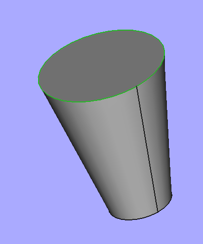
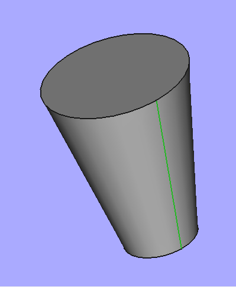
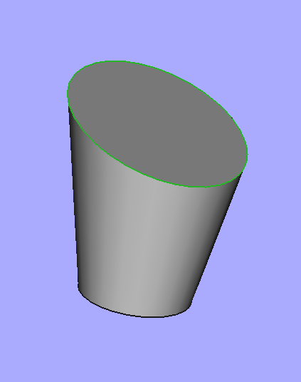
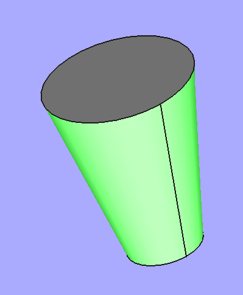
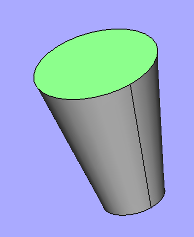
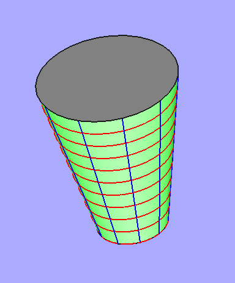
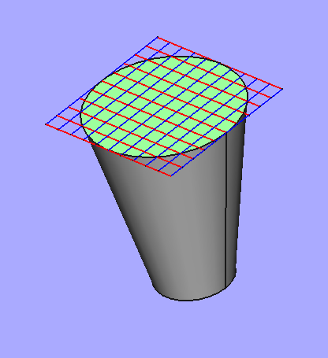
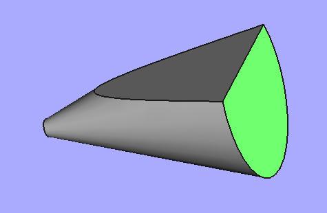
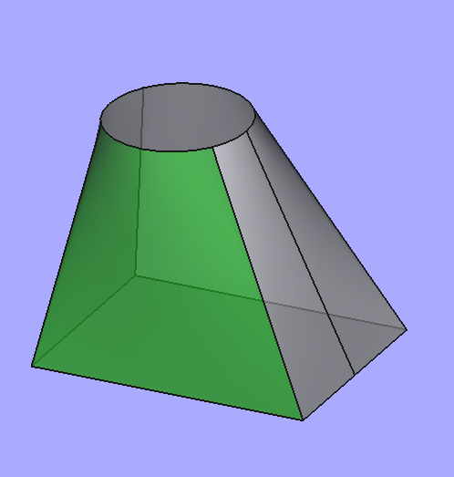
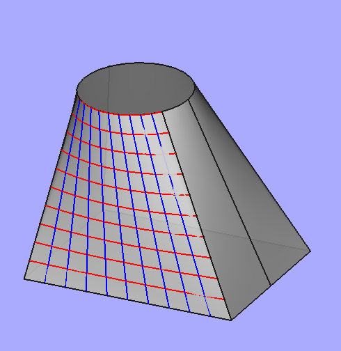

<link href="css/JMC_FreeCAD_Doc.css" rel="stylesheet"></link> 


<span id="table_of_content"> Table des matières </span>
<!-- TOC -->

- [1. Sous-objets topologiques et géométriques](#1-sous-objets-topologiques-et-géométriques)
    - [1.1. Introduction](#11-introduction)
        - [1.1.1. Généralités](#111-généralités)
        - [1.1.2. Mise en pratique](#112-mise-en-pratique)
    - [1.2. Faces, Wires, Edges et Vertices](#12-faces-wires-edges-et-vertices)
    - [1.3. Sous-objets géométriques](#13-sous-objets-géométriques)
        - [1.3.1. Support d'un Vertex (Point)](#131-support-dun-vertex-point)
        - [1.3.2. Support d'un Edge (Curve)](#132-support-dun-edge-curve)
        - [1.3.3. Support d'une Face (Surface)](#133-support-dune-face-surface)
    - [1.4. Exemples d'utilisation](#14-exemples-dutilisation)
        - [1.4.1. Courbes coordonnées d'une surface](#141-courbes-coordonnées-dune-surface)
        - [1.4.2. Exemple avec des B-Spline](#142-exemple-avec-des-b-spline)
    - [1.5. Et l'inverse : du simple au complexe?](#15-et-linverse -du-simple-au-complexe)
    - [1.6. Matériel à trier](#16-matériel-à-trier)

<!-- /TOC -->
# 1. Sous-objets topologiques et géométriques

<i>Ce texte reflète mon expérience de découverte de ces notions à la suite
en particulier de la lecture sur le forum de ce [post de
Chris_B](https://forum.freecadweb.org/viewtopic.php?t=31313#p260053) ou
[cet
autre](https://forum.freecadweb.org/viewtopic.php?f=22&t=55956#p481439).
Il ne faut pas chercher dans ce qui suit une liste exhaustive des
propriétés concernées (ce qui serait impossible) mais plutôt une
introduction permettant au lecteur de devenir un peu plus autonome dans
la découverte de leur manipulation.</i>

## 1.1. Introduction

### 1.1.1. Généralités

Un objet *FreeCAD*, expose naturellement certaines de ses
caractéristiques.

-   Une *Box* par exemple expose ses trois dimensions dans la fenêtre
    *Propriété/Données*, et l'utilisateur peut les y modifier facilement
    avec visualisation immédiate du résultat.
-   Il en est de même pour un (tronc de) cône, qui expose angle, hauteur
    et ses deux rayons.
-   Pour un objet *PartDesign*, c'est dans les fonctions (*features*)
    qui ont servi à le construire que l'on trouve certaines propriétés
    comme par exemple dimension d'une protusion ; et on peut aussi les
    modifier avec effet immédiat sur la représentation *3D*.
-   Pour un objet de type *FeaturePython*, le concepteur peut aussi
    exposer certaines propriétés dans la fenêtre *Propriété/Données* (cf. *addProperty*)

Mais il y a bien d'autres entités que l'on peut aller dénicher dans un
objet, et qui sont liées au format qu'utilise *FreeCAD* pour représenter
ses objets *3D* en interne : le
[***B-Rep***](https://fr.wikipedia.org/wiki/B-Rep) (***B**oundary
**Rep**resentation* en anglais) traduit par *Représentation Frontière*
ou *Représentation par les Bords*.
-   Dans *FreeCAD*, à l'exception des [objets de type
    *Mesh*](https://wiki.freecadweb.org/Mesh), quasiment tous les objets ayant
    une représentation *3D* possèdent une [Shape](https://wiki.freecadweb.org/Shape).
-   Contrairement 
    à la [CSG](https://fr.wikipedia.org/wiki/Géométrie_de_construction_de_solides)
    qui travaille à partir de solides simples et d'opérations booléennes,
    avec la *B-Rep*, un objet *3D* est entièrement représenté par son bord.
    C'est une technique qui sépare :
    -   d'une part, les éléments topologiques, de type [*'Part::TopoShape'*](https://wiki.freecadweb.org/Shape),
        comme par exemple faces, arêtes, sommets) et les relations
      (adjacence, incidence) qu'ils ont entre eux ; 
    -   d'autre part, les éléments géométriques de type *Part::Geom...*,
        comme *Part::GeomLine* (pour une ligne) ou *'Part::GeomCircle'*
      (pour un cercle) ; on peut voir ces derniers comme les supports des
     précédents, qui définissent leur position dans l'espace.
-   Un [*Body*](https://wiki.freecadweb.org/Body)
     créé avec [l'atelier *PartDesign*](https://wiki.freecadweb.org/PartDesign_Workbench), possède une *Shape* que l'on trouve dans *Bodyxxx.Shape*.
-   Un objet de type [*Part*](https://wiki.freecadweb.org/Part) qui
    regroupe plusieurs [*Bodies*](https://wiki.freecadweb.org/Body)
    possède donc une collection de *Shapes*, mais aucune qui lui soit propre.

Sur [cette
page](https://wiki.freecadweb.org/index.php?title=Topological_data_scripting),
on en trouve une présentation succincte et un organigramme intéressant.

<a href="#table_of_content">Retour Table des matières</a>

### 1.1.2. Mise en pratique

Pour un objet donné, toutes ces entités se trouvent dans son sous-objet
*Shape* ; par exemple, pour une <span class="fr_obj"> Box </span> créée avec
l'atelier *Part*, et que l'on peut manipuler en *Python* à l'aide de :
``` python
>>> obj = App.ActiveDocument.Box
```

ces entités topologiques et géométriques se trouvent dans :

``` python 
>>> obj_shape = obj.Shape 
```

Il en est de même pour tout objet *3D* *FreeCAD*, quelle que soit la
façon dont on l'a construit.

<a href="#table_of_content">Retour Table des matières</a>

## 1.2. Faces, Wires, Edges et Vertices

Par ordre de complexité décroissante, les principales entités
topologiques d'un objet *3D* référencé par <span class="py_var">obj</span> de *FreeCAD* sont retournées
par les propriétés suivantes.

- L'évaluation de <span class="py_atr">obj.Shape.Faces</span> 
    retourne la liste des faces de <span class="py_var">obj</span>.
    -   Ainsi pour tout entier <span class="py_var">i</span> strictement 
        inférieur à <span class="py_var">len(obj_shape.Faces)</span>,
        ```` python
        >>>> obj.Shape.Faces[i]
        ````
        donne une référence vers la face d'index 
        <span class="py_var">i</span> de <span class="py_var">obj</span>.

    -   Prendre garde qu'en programmation *Python*, 
        l'index <span class="py_var">i</span> commence à *0*, 
        alors que dans le *Gui* de *FreeCAD*, les indices des faces
        qui s'affichent dans la barre d'état commencent à *1*.

- <span class="py_atr">obj.Shape.Wires</span> 
    retourne la liste des contours fermés plans de <span class="py_var">obj</span>.
    - Ainsi pour tout entier <span class="py_var">j</span> strictement inférieur à
        <span class="py_var">len(obj_shape.Wires)</span>,
        ```` python
        >>>> obj.Shape.Wires[j]
        ````
        retourne une référence vers le contour fermé d'index 
        <span class="py_var">j</span> de <span class="py_var">obj</span>.
    -   Même mise en garde que précédemment concernant le domaine où varie
        <span class="py_var">j</span>.
    -   Toutefois ***Wires*** est aussi une propriété d'un objet face et 
        l'instruction :
        ```` python
        >>>> obj.Shape.Faces[i].Wires
        ````
        retourne la liste de tous les contours fermés de la face d'index
        <span class="py_var">i</span> de <span class="py_var">obj</span>.
    -   En revanche, la complétion automatique ne fonctionne pas 
        si l'on tape:
        ```` python
        >>>> obj.Shape.Faces[i].
        ````
        Lorsque le point «.» est ainsi précédé d'un sélecteur, 
        la fenêtre de complétion n'a pas l'air de fonctionner correctement ; 
        pour la retrouver j'ai dû faire l'affectation:
        ```` python
        >>>> f = obj.Shape.Faces[i]
        ````
        avant de taper 
        ```` python
        >>>> f.
        ```` 
        et de pouvoir la retrouver.

- <span class="py_atr">obj.Shape.Edges</span> retourne la liste des arêtes 
    de <span class="py_var">obj</span>.
    -   On peut faire exactement les mêmes remarques que précédemment 
        concernant l'index <span class="py_var">k</span> permettant d'accéder à un élément d'une telle liste.
    -   Cette propriété <span class="py_atr">Edges</span> peut s'appliquer aussi
        bien à un objet *3D*, qu'à l'une des ses *Faces*, voire 
        à l'un de ses *Wires*;
    elle retourne alors les arêtes correspondantes.

- <span class="py_atr">obj.Shape.Vertexes</span> donne la liste 
    des sommets de <span class="py_var">obj</span> ; 
    mais comme précédemment, cette propriété peut
    aussi s'appliquer à l'une de ses *Faces*, 
    l'un de ses *Wires* ou l'un de ses *Edges*.


Comme on peut le vérifier à l'aide de la console *Python*, 
chacun des sous-objets précédents possède le même type, 
qui est *Part::TopoShape*.
```` python
>>>> obj.Shape.Faces[0].TypeId , obj.Shape.Vertexes[0].TypeId

'Part::TopoShape' , 'Part::TopoShape'
````

En revanche, chaque catégorie a un *ShapeType* différent :
```` python
>>>> obj.Shape.Faces[0].ShapeType , obj.Shape.Vertexes[0].ShapeType

'Part::TopoShape' , 'Vertex'
````
À chacune des entités topologiques précédente est associée 
une entité géométrique, support sur laquelle elle est construite : un point, une courbe ou une surface. 
Nous les étudions dans la suite.

<a href="#table_of_content">Retour Table des matières</a>

## 1.3. Sous-objets géométriques

### 1.3.1. Support d'un Vertex (Point)

- Si <span class="fr_obj">Box</span> 
  est un cube par défaut construit avec *Part*, 
  on obtient la liste de ses sommets avec&nbsp;:
  ```` python
  >>> App.ActiveDocument.Box.Shape.Vertexes
  [<Vertex object at 0x55a4e9d85bb0>, <Vertex object at 0x55a4e9dce3e0>, .... ]
  ````
-   Pour obtenir le sommet qui s'affiche comme 
    *Vertex6* dans la barre d'état, taper :
    ```` python
    >>> v = App.ActiveDocument.Box.Shape.Vertexes[5] # Décalage de 1
    ````
-   La récupération des coordonnées du sommet 
    se fait alors avec :
    ```` python
    >>> v.Point
    Vector (10.0, 0.0, 0.0)
    ````
-   Si l'on ne veut que la liste des points de *Face3*, on tape :
    ```` python
    >>> App.ActiveDocument.Box.Shape.Faces[2].Vertexes
    [<Vertex object at 0x55a4e98f1150>, <Vertex object at 0x55a4e8f62980>, ... ]
    ````

<a href="#table_of_content">Retour Table des matières</a>

### 1.3.2. Support d'un Edge (Curve)

Si <span class="fr_obj">e</span> est une arrête, 
avec donc 
<span class="py_atr">e.ShapeType == 'Edge'</span>, alors:
```` python
e.Curve
````
retourne une référence vers une
courbe la contenant, et que *FreeCAD* traite le plus souvent comme courbe paramétrée.

Prenons l'exemple du (tronc de) cône défini 
avec les valeurs par défaut de l'atelier *Part*.

- Commençons par récupérer la *Shape* de l'objet :
   
  ```` python
  >>> obj_sh = App.ActiveDocument.Cone.Shape
  ````
-   Dans mon cas, le cercle supérieur s'affiche 
    dans la barre d'état comme *Edge1*, 
    et je le récupère donc avec :
    ```` python
    >>> edg_1 = obj_sh.Edges[0]
    ````
    Je peux en afficher le *ShapeType*
    ```` python
    >>>> edg_1.ShapeType
    'Edge'
    ````
-   Je fais alors pointer <span class="py_var">curv_1</span>
    vers sa <span class="py_atr">Curve</span>
    ```` python
    >>> curv_1 = edg_1.Curve
    ```` 
-   Cette courbe est de type *'Part::GeomCircle'* et, 
    comme on peut le vérifier, *FreeCAD* en utilise une représentation paramétrique avec
    un angle variant de 0 à 6.28... = 2π radians.
    ```` python
    >>> curv_1.TypeId, curv_1.FirstParameter,curv_1.LastParameter
    'Part::GeomCircle' , 0.0 , 6.283185307179586
    ````
-   J'ai découvert les trois propriétés précédentes 
    en utilisant la complétion usuelle dans la console *Python*. Elle permet aussi de
    trouver plein d'autres propriétés comme par exemple :
    ```` python
    >>> curv_1.isPeriodic()
    True
    >>> curv_1.__doc__ # qui retourne la docstring
    'Describes a circle in 3D space ....'
    ````
-   Remarquer que l'on peut aussi trouver le domaine 
    de variation du paramètre au niveau du *Edge*.
    ```` python
    >>> edg_1.ParameterRange
    (0.0, 6.283185307179586)
    ````

Intéressons-nous maintenant à la génératrice colorée en vert.
  

-   Dans mon cas, je la vois s'afficher 
    dans la barre d'état comme *Edge2*, et je le récupère donc avec:
    ```` python
    >>> edg_2 = obj_sh.Edges[1]
    ````
-   Je peux en afficher le *ShapeType*:
    ````
    >>> edg_2.ShapeType
    'Edge'
    ````
-   Je fais alors pointer *curv_2* vers sa *Curve*: 
    ```` python
    >>> curv_2 = edg_2.Curve
    ````
-   Cette courbe est de type *'Part::GeomLine'*
    ````
    >>> curv_2.TypeId
    'Part::GeomLine'
    ````
-   Si comme précédemment, on essaie d'en trouver le domaine du
    paramètre, avec *curv_2* :
    ```` python
    >>> curv_2.FirstParameter , curv_2.LastParameter
    -2e+100 , 2e+100
    ````
    et avec l'objet topologique dont c'est le support:
    ```` python
    >>> edg_2.ParameterRange
    (0.0, 10.198039027185569)
    ````
    on voit que *FreeCAD* traite ici différemment:
    -   l'arrête (*Edge*) qui est un segment donc borné,
    -   son support qui est une droite quasi non bornée 
        (*2e+100* jouant le rôle de l'infini).


Si l'on coupe le cône par un plan qui n'est pas
orthogonal à son axe de symétrie, on obtient une ellipse ou une
hyperbole (voire exceptionnellement une parabole) suivant l'orientation du plan.

- Si, comme ci-contre l'ellipse s'affiche en tant que *Edge1*, 
    on récupère l'objet topologique par:
    ```` python
    edg = App.ActiveDocument.Cut.Shape.Edges[0]
    ````
    puis son support par :
    

    ```` python
    curv = edg.Curve
    
    ````
-   Avec la complétion automatique, on voit que l'on peut avoir :
    ```` python
    >>> curv.Eccentricity

    >>> curv.Focus1

    >>> curv.MajorRadius
    ````
    dont les noms sont suffisamment éloquents.

Le lecteur curieux pourra vérifier :
-   que dans le cas d'un ellipse, les bornes du paramètre sont les mêmes
    avec <span class="py_var">edg</span> et avec <span class="py_var">curv</span>,
-   alors que dans le cas d'une hyperbole, l'objet topologique reste
    borné alors que son support géométrique (comme pour les droite) est
    quasi infini !


<a href="#table_of_content">Retour Table des matières</a>

### 1.3.3. Support d'une Face (Surface)

Si <span class="py_var">f</span> est une face, 
avec donc <span class="py_var">f.ShapeType == 'Face'</span>, 
alors <span class="py_var">f.Surface</span> 
retourne une référence à une surface la contenant, 
que *FreeCAD* traite comme une surface paramétrée, 
les paramètres étant appelés <span class="py_var">U</span> 
et <span class="py_var">V</span>.


Prenons encore l'exemple du (tronc de) cône défini avec
les valeurs par défaut de l'atelier *Part*.
-   Commençons par récupérer la *Shape* de l'objet :
    ```` python
    >>> obj_sh = App.ActiveDocument.Cone.Shape
    ````
-   Dans mon cas, la surface latérale (en vert) s'affiche dans la barre
    d'état comme *Face1*, et je le récupère donc avec :
    ```` python
    >>> fac_1 = obj_sh.Faces[0]
    ````
    Rappelons que pour l'index il y a un décalage de *1* entre ce qui est vu
    dans le *Gui* et celui de la liste *Python*.
-   Je peux en afficher le *ShapeType*:
     ```` python
     >>> fac_1.ShapeType
     
     'Face'
-   Je fais alors pointer <span class="py_var">surf_1</span> 
    vers sa *Surface* qui est de type *'Part::GeomCone'*
    ```` python
    >>> surf_1 = fac_1.Surface
    >>> surf_1.TypeId
    'Part::GeomCone'
-   En utilisant la complétion, on voit que l'on peut alors en trouver
    son sommet, son axe (point & vecteur), son demi-angle au sommet, ...
    ```` python
    >>> surf_1.Apex
    Vector (0.0, 0.0, -10.0)
    >>> surf_1.Center , surf_1.Axis
    Vector (0.0, 0.0, 0.0) , Vector (0.0, 0.0, 1.0)
    >>> surf_1.Radius
    2.0
    >>> surf_1.SemiAngle
    0.19739555984988078
-   Cette surface, de type *'Part::GeomCone'*, est paramétrée par
    l'angle de rotation autour de l'axe du cône et la distance sur
    l'arête qui vaut au maximum *10/cos(surf_1.SemiAngle)* car le cône
    est de hauteur 10mm. On trouve bien cette limite supérieure avec le
    <span class="py_var">ParameterRange</span> de la face, mais pas avec la surface dont
    les génératrices sont des droites, donc « infinies ».
    ```` python
    >>> fac_1.ParameterRange
    (0.0, 6.283185307179586, 0.0, 10.198039027185569)
 
    >>> surf_1.bounds()   # ne pas oublier les ( ) car c'est une méthode
    (0.0, 6.283185307179586, -2e+100, 2e+100)
    ````
**Remarque** L'ensemble des couples (*U*,*V*)
permettant de décrire toute la surface est donc le rectangle défini
par : *0 ≤ U ≤ 6.28*... et *0 ≤ V ≤ 10.19...*

Faisons la même chose avec la face supérieure de ce
cône, en vert sur le dessin ci-contre. 
Dans mon cas,elle s'affiche dans
la barre d'état comme *Face2.*


-   Je le récupère donc avec :
    ```` python
    >>> fac_2 = obj_sh.Faces[1]
-   Je peux en afficher le *ShapeType*:
    ```` python
    >>> fac_2.ShapeType
    'Face'
    ````
-   Je fais alors pointer <span class=py_var>surf_2</span> vers
    sa *Surface* qui est de type *'Part::GeomPlane'*
    ```` python
    >>> surf_2 = fac_2.Surface
    >>> surf_2.TypeId
    'Part::GeomPlane'
    ````
- La surface, de type *'Part::GeomPlane'*, est un plan paramétré 
    par ses deux coordonnées ;
    -   comme un tel plan est non borné, 
        la méthode <span class="py_atr">bounds( )</span> appliquée à cette surface retourne des valeurs « infinies » de l'ordre de *2e+100*,
        ```` python
        >>> surf_2.bounds()
        (-2e+100, 2e+100, -2e+100, 2e+100)
        ````
    -   alors que les paramètres décrivant la face 
        sont les mêmes coordonnées mais bornées par&nbsp;*4* :
        ```` python
        >>> fac_2.ParameterRange
        (-4.0, 4.0, -4.0, 4.0)
        ````

<a href="#table_of_content">Retour Table des matières</a>

## 1.4. Exemples d'utilisation

### 1.4.1. Courbes coordonnées d'une surface

Pour visualiser la façon dont une surface est paramétrée 
avec les valeurs *U* et *V*, 
on peut tracer les deux familles de courbes coordonnées, 
à *U* constant pour la première et à *V* constant pour la seconde. 
Pour cela, en plus de ce que l'on a déjà vu, on utilise :

-   d'abord ***surface.uIso(u)*** qui retourne 
    la courbe coordonnée de *surface* à *U* constant ; 
    c'est un objet géométrique ;
-   puis la méthode *toShape(v_min,v_max)* qui transforme
    l'objet géométrique précédent en un objet topologique que l'on peut alors ajouter au document courant.

**Remarque** On peut aussi utiliser la méthode ***toShape*** sans
paramètre lorsque les courbes que l'on manipule sont bornées ; mais dans
le cas d'un cône par exemple, les génératrices (droites géométriques)
sont non bornées et il est indispensable de mettre des bornes.

La fonction suivante permet de visualiser ces deux familles de lignes.
```` python 
def trace_isoline(body_name, face_number, nb_curves=10):
    # get the face (here face_number is what we see with the GUI)
    face = App.ActiveDocument.getObject(body_name).Shape.Faces[face_number-1]
    # get the geometric surface of the face
    surface = face.Surface
    # get the parametric bounds (u_min, u_max, v_min, v_max) of the (parametric) surface
    # One can also use limits = surface.bounds(),
    # but it is "inifnite" for non bound objects such lines
    limits = face.ParameterRange
    u_min, u_max, v_min, v_max = limits
    # Drawing of the u-isoparametric curve
    u = u_min
    h = (u_max-u_min)/ nb_curves
    while u <= u_max:
        # get the u-isoparametric curve
        lu = surface.uIso(u)
        # Add it to the document with blue color
        obj = App.ActiveDocument.addObject('Part::Feature',"ligne_Iso_u")
        obj.ViewObject.LineColor = (0.0,0.0,1.0)
        # Put the Shape of the curve into the object
        # (the use of v_min and v_max is madatory in the case of line, to clip it)
        obj.Shape =lu.toShape(v_min,v_max)
        # Next u value
        u += h
    # Likewise drawing of the v-isoparametric curve
    v = v_min
    h = (v_max-v_min)/ nb_curves
    while v <= v_max:
        lv  = surface.vIso(v)
        obj = App.ActiveDocument.addObject('Part::Feature',"ligne_Iso_v")
        obj.Shape =lv.toShape(u_min,u_max)
        obj.ViewObject.LineColor = (1.0,0.0,0.0)
        v += h
    
````
On peut utiliser cette fonction pour tracer ces courbes coordonnées sur
la surface verte d'un cône de nom *Cone* obtenu avec l'atelier
*Part*. Comme cette surface s'affiche en tant que *Face1*, on tape :

```` python
>>> trace_isoline('Cone',1)
````
On voit alors :
-   les courbes bleues : sur chacune d'elles, l'angle *U* est
    constant, alors que *V* varie de 0 à la longueur maximum de
    l'arête.
-   les courbes rouges : sur chacune d'elles, la distance *V* est
    constante, alors que l'angle *U* varie de 0 à 2π.

Si on utilise alors cette fonction *trace_isoline* pour
obtenir les courbes coordonnées à *U* et à *V* constant de la face supérieure du même cône  :

```` python
>>> trace_isoline('Cone',2)
````


on obtient le quadrillage ci-contre, qui correspond bien au domaine
donné par le <span class="py_var">ParameterRange</span>&nbsp;:

*-4 ≤ U ≤ 4 et -4 ≤ V ≤ 4*

mais qui n'est pas vraiment ce que l'on attend.

Pour récupérer le cercle, on peut utiliser *OuterWire*, qui retourne
un *Wire* dont on peut alors extraire le cercle.
```` python
>>> e = fac_2.OuterWire.Edges[0]
>>> e.Curve
Circle (Radius : 4, Position : (0, 0, 10), Direction : (0, 0, 1))
````

**Remarque** Dans un cas comme celui de droite, où

-   l'intersection du plan avec le cône est une hyperbole,
-   la génératrice initiale du cône est en dessous,

le *OuterWire* possède trois composantes, ce qui n'est pas
évident à première vue !

```` python
>>> f = App.ActiveDocument.Cut.Shape.Faces[2]
>>> f.OuterWire.Edges
[<Edge object at 0x558e4df9c660>,
 <Edge object at 0x558e4de7eed0>,
 <Edge object at 0x558e4de99350>]
````
<a href="#table_of_content">Retour Table des matières</a>

### 1.4.2. Exemple avec des B-Spline

Regardons le cas de la face verte du loft ci-contre
réalisé entre un rectangle du plan *z=0* et un cercle du plan *z=50*.


Comme elle s'affiche en tant que *Face6*, je pose :
```` python
>>> f = App.ActiveDocument.Body.Shape.Faces[5]
>>> c=f.Surface
>>> c.TypeId
'Part::GeomBSplineSurface'
````
Pour cette surface de type *B-Spline* les bornes des paramètres *U* et *V* sont les mêmes, 
qu'on les prenne sur l'objet topologique
*f* ou sur l'objet géométrique *c*.
```` python
>>> c.bounds() , f.ParameterRange
(0.0, 62.340035, 0.0, 1.0) , 0.0, 62.340035, 0.0, 1.0)
````


Pour visualiser ce paramétrage, on peut écrire&nbsp;:
```` python
>>> trace_isoline('Body',6)
````
-   chaque courbe bleue correspondant à une valeur donnée de
    *U* choisie entre *0* et *62.34\...*, alors que
    *V* varie de *0* à *1*.
-   chaque courbe rouge correspondant à une valeur donnée de
    *V* choisie entre *0* et *1*, alors que *U* varie
    de *0* à *62.34\...*

<a href="#table_of_content">Retour Table des matières</a>


## 1.5. Et l'inverse : du simple au complexe?

Inversement, [sur cette
page](https://wiki.freecadweb.org/index.php?title=Topological_data_scripting),
on peut trouver comment construire des objets géométriques ainsi que des
objets topologiques.

-   Certaines fonctions 
    comme <span class="py_var">Part.makeLine( )</span> ou
    <span class="py_var">Part.makePolygon( )</span> donnent directement un objet de type
    *'Part::TopoShape'*, et il faut passer par <span class="py_var">.Curve</span> pour
    en obtenir l'objet géométrique sous-jacent
-   D'autres comme <span class="py_var">Part.LineSegment( )</span> ou
    <span class="py_var">Part.BezierCurve()</span> 
    retournent un objet géométrique, et il faut
    ensuite utiliser une méthode <span class="py_var">.toShape( )</span> pour le
    transformer en un objet topologique, de type *'Part::TopoShape'*.
-   On peut aussi regarder par exemple [ce
    post](https://forum.freecadweb.org/viewtopic.php?f=22&t=56308) qui
    en parle.


<a href="#table_of_content">Retour Table des matières</a>

## 1.6. Matériel à trier 

<details>

$### 1.6.1. La fonction toShape(...) 

J'ai décortiqué la fonction dans Curve2dPyImp.cpp

toShape(\...) method of Part.Line instance

 Return the shape for the geometry.

toShape(\...) method of Part.Plane instance

 Return the shape for the geometry.

\# J'ai décortiqué la fonction dans Curve2dPyImp.cpp

PyArg_ParseTuple()

https://matthieu-brucher.developpez.com/tutoriels/python/api-c-numpy/
(pour O!)

http://sdz.tdct.org/sdz/introduction-au-scripting-avec-python.html

https://python.jpvweb.com/python/mesrecettespython/doku.php?id=exemple_python_cpp

https://www.oreilly.com/library/view/python-in-a/0596001886/re1107.html

https://docs.python.org/3/c-api/arg.html (pour O!)

https://docs.python.org/fr/3.7/c-api/arg.html (pour O!)

https://askcodez.com/lextension-de-python-avec-c-passer-dune-liste-a-pyarg_parsetuple.html

int PyArg_ParseTuple(PyObject \*args, const char \*format, \...)

 Parse the parameters of a function that takes only positional
parameters into local variables.

 Returns true on success; on failure, it returns false and raises the
appropriate exception.

<a href="#table_of_content">Retour Table des matières</a>


$### 1.6.2. Selection

Voir le script de [cette
page](https://wiki.freecadweb.org/Macro_SimpleProperties) sur la
sélection

Voir aussi <https://wiki.freecadweb.org/Selection_API> pour distinguer
entre getSelection et getSelectionEx

$### 1.6.3. B- Spline

[Un peu de
théorie](https://www.math.univ-paris13.fr/~basdevan/Licence/B-Spline.pdf)
sur les courbes de Bézier et le B-spline

<https://wiki.freecadweb.org/B-Splines>

<https://forum.freecadweb.org/viewtopic.php?t=13124>

<https://fr.wikipedia.org/wiki/Spline>

<https://fr.wikipedia.org/wiki/B-spline>

<https://pages.mtu.edu/~shene/COURSES/cs3621/NOTES/notes.html>

<https://www-ljk.imag.fr/membres/Nicolas.Szafran/ENSEIGNEMENT/MASTER2/CS/courbes-polynomiales.pdf>

<http://info.usherbrooke.ca/ogodin/enseignement/imn428/Chapitres/imn428-chap05.pdf>

<https://www.fil.univ-lille1.fr/~aubert/m3ds/m3ds_courbe.pdf>

<https://team.inria.fr/virtualplants/files/2014/09/cours_NURBS.pdf>

<https://forum.freecadweb.org/viewtopic.php?f=22&t=55630>

les [NURBS = Non Uniform Rational Basis
Spline](https://forum.freecadweb.org/viewtopic.php?t=18010&start=40)

[surface
flattening](https://forum.freecadweb.org/viewtopic.php?f=8&t=18010)

$### 1.6.4. Open-Cascade

<https://dev.opencascade.org/doc/refman/html/index.html>

<https://dev.opencascade.org/doc/refman/html/_b_rep___tool_8hxx.html>

-   Un index de [tout ce que l'on peut faire avev
    openCascade](https://dev.opencascade.org/doc/overview/html/index.html)
-   Une [page intéressante sur les
    handle](https://dev.opencascade.org/doc/overview/html/occt_user_guides__foundation_classes.html#occt_fcug_1)

<https://dev.opencascade.org/doc/overview/html/occt__tutorial.html>

$### 1.6.5. Divers

Dans [ce post de
Chris_G](https://forum.freecadweb.org/viewtopic.php?f=22&t=52989#p455325),
on trouve :*Second important thing : get a clear understanding of BREP
(Boundary Representation) used by OpenCascade to create geometric
objects. It is separated into 2 levels:*

\- Geometry (points, curves, surfaces) that are used as support entities
to define topology\
- Topology (vertexes, edges, faces, wires, shells, solids) that are
"visible" (and bounded) objects built upon a geometry

<http://free-cad.sourceforge.net/SrcDocu/d9/d35/classPart_1_1TopoShapeFacePy.html>

voir [toujours de
chris_G](https://forum.freecadweb.org/viewtopic.php?t=31313#p260053)
(revoir toute la discussion)

<https://forum.freecadweb.org/viewtopic.php?p=232159>

<https://forum.freecadweb.org/viewtopic.php?t=7316>

<https://forum.freecadweb.org/viewtopic.php?t=53782>

<https://forum.freecadweb.org/viewtopic.php?t=15313>

<https://forum.freecadweb.org/viewtopic.php?t=15313>

On dirait que Surface et Curve sont définis dans <BRep_Tool.hxx>

voir
<https://dev.opencascade.org/doc/refman/html/class_geom___surface.html>

</details>